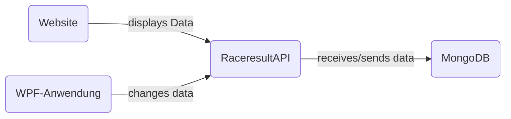
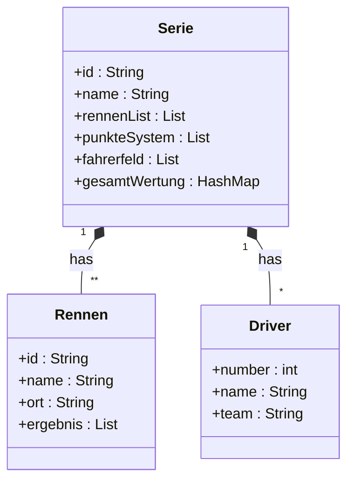

# CountryGuide-API
Dieses Projekt beinhaltet einen Server, welcher eine REST-API bereitstellt, sowie 2 Clients, welche auf diese API zugreifen und die CRUD-Operationen abbilden. Bei diesen 2 Clients handelt es sich um eine WPF-Anwendung und eine Website gemacht mit HTML, CSS und Javascript. 

Meine Idee war eine API, mit welcher man über den Website-Client ganz einfach verschiedene wichtige Informationen über Länder bekommt. Es soll ebenfalls möglich sein diese Daten in der WPF-Anwendung zu verändern (Admin-Client). Außerdem soll es einfach möglich sein, die Informationen welche gespeichert werden in Zukunft leicht erweitern zu können.

## Inhaltsverzeichnis
- [Softwaredesign](#softwaredesign)
- [Beschreibung Software](#beschreibung-der-software)
- [API Beschreibung](#api-beschreibung)
- [Diagramme](#diagramme)
- [Diskussion](#diskussion)

<br>

## Softwaredesign



#### CountryGuide-API
Der Server + API bildet das Herzstück des Projektes. Der Server und die API-Endpoints sind in Java und mit dem Spring Boot Framework programmiert. Die API verwaltet alle Anfragen der Clients und speichert/sendet Daten von der MongoDB-Datenbank.

#### Website mit HTML, CSS, Javascript
Die Website dient als einfache Benutzeroberfläche, auf welcher die Nutzer ganz einfach mit einem Textfeld von jedem in der Datenbank gespeicherten Land verschiedene nützliche Informationen bekommen können. Außerdem kann man sich alle Länder welche gespeichert sind anzeigen lassen und direkt per Klick auf den Namen ein Land aufrufen. 

#### WPF Anwendung
Die WPF Anwendung dient als "Adminprogramm" der CountryGuide-API. Über die WPF Anwendung können alle Daten einfach hinzugefügt, geändert, oder auch gelöscht werden.

## Beschreibung der Software
#### CountryGuide-API
Für den Server und die API wurden folgende Dependencies verwendet:

```xml 
<dependencies>
        <dependency>
            <groupId>org.springframework.boot</groupId>
            <artifactId>spring-boot-starter-actuator</artifactId>
        </dependency>
        <dependency>
            <groupId>org.apache.httpcomponents</groupId>
            <artifactId>httpclient</artifactId>
            <scope>test</scope>
        </dependency>
        <!-- https://mvnrepository.com/artifact/com.googlecode.json-simple/json-simple -->
        <dependency>
            <groupId>com.googlecode.json-simple</groupId>
            <artifactId>json-simple</artifactId>
            <version>1.1.1</version>
        </dependency>
        <dependency>
            <groupId>org.springframework.boot</groupId>
            <artifactId>spring-boot-starter-actuator</artifactId>
        </dependency>
        <dependency>
            <groupId>org.springframework.boot</groupId>
            <artifactId>spring-boot-starter-data-mongodb</artifactId>
        </dependency>
        <dependency>
            <groupId>com.h2database</groupId>
            <artifactId>h2</artifactId>
            <scope>runtime</scope>
        </dependency>
        <dependency>
            <groupId>org.springframework.boot</groupId>
            <artifactId>spring-boot-starter-test</artifactId>
            <scope>test</scope>
        </dependency>

        <dependency>
            <groupId>org.springframework.cloud</groupId>
            <artifactId>spring-cloud-dependencies</artifactId>
            <version>${spring-cloud.version}</version>
            <type>pom</type>
            <scope>import</scope>
        </dependency>
        <dependency>
            <groupId>org.springframework.cloud</groupId>
            <artifactId>spring-cloud-starter-circuitbreaker-resilience4j</artifactId>
        </dependency>
        <dependency>
            <groupId>org.springframework.cloud</groupId>
            <artifactId>spring-cloud-starter-gateway</artifactId>
        </dependency>

        <dependency>
            <groupId>org.springframework.boot</groupId>
            <artifactId>spring-boot-starter-test</artifactId>
            <scope>test</scope>
        </dependency>
        <dependency>
            <groupId>org.springframework.cloud</groupId>
            <artifactId>spring-cloud-starter-contract-stub-runner</artifactId>
            <scope>test</scope>
        </dependency>
</dependencies>
```

Außerdem muss man die API-Endpoints bereitstellen. Der folgende Codeabschnitt zeigt die Implementierung des Endpoints <code><b>/addCountry</b></code>: 

```java
@RequestMapping(method=RequestMethod.POST, value="/addCountry")
        public String addCountry(@RequestBody Country country) {
            countryService.addCountry(country);
            String response = "{\"success\": true, \"message\": Country was added successfully.}";
            return response;
        }
```

Der Punkt [API Beschreibung](#api-beschreibung) beschreibt die genaue Funktion von diesem und anderen Endpoints genauer. 

### Website
Die Website basiert auf basic HTML, CSS und Javascript. Die wichtigen Teile des Codes sind dabei die GET-Zugriffe auf die API. 

##### GET-Request
Im folgenden Abschnitt ist die GET-Methode implementiert, welche beim Klicken des Search-Buttons ausgeführt wird: 
```javascript
function getCountry (countryInp) {
    let countryName = countryInp;
    let finalURL = `http://localhost:3001/getcountry/${countryName}`;
    console.log(finalURL);

    fetch(finalURL).then((response) => response.json()).then((data) => {
        var cpopulation = (data.population).toLocaleString(
            undefined, { minimumFractionDigits: 0 }
          );

        result.innerHTML = `
            
            <h2>${data.countryname}</h2>
            <div class="wrapper">
                <div class="data-wrapper">
                    <h4>Capital:</h4>
                    <span>${data.capital}</span>
                </div>
            </div>
            <div class="wrapper">
                <div class="data-wrapper">
                    <h4>Continent:</h4>
                    <span>${data.continent}</span>
                </div>
            </div>
            <div class="wrapper">
                <div class="data-wrapper">
                    <h4>Population:</h4>
                    <span>${cpopulation}</span>
                </div>
            </div>
            <div class="wrapper">
                <div class="data-wrapper">
                    <h4>Currency:</h4>
                    <span>${data.currency}</span>
                </div>
            </div>
            <div class="wrapper">
                <div class="data-wrapper">
                    <h4>Common Languages:</h4>
                    <span>${Object.values(data.common_languages).toString().split(",").join(", ")}</span>
                </div>
            </div>
        `;
    })
}
```

Wie man sehen kann, wird sich zuerst vom Textfeld der Name des gewünschten Landes geholt, anschließend werden die Informationen mit der <code>fetch()</code> Methode vom Server geholt und es werden HTML-Elemente erstellt, welche die Daten anzeigen.

#### WPF Anwendung
Da die WPF Anwendung, gleich wie die Blazor WebApp, in C# implementiert wurde ist der Code, welcher für die Interaktion mit der RaceresultAPI zuständig ist, sehr ähnlich zu dem der Blazor WebApp. Lediglich die Codeteile, welche die Darstellung der Daten vornehmen unterscheidet sich. 

##### POST-Request 
Im nachfolgendem Codeabschnitt ist die Implementierung eines POST-Requests dargestellt.
```c#
 JObject json = new JObject
{
	{ "name", addName },
	{ "punkteSystem", punkteSys }
};

HttpContent content = new StringContent(json.ToString(), Encoding.UTF8, "application/json");

Task<string> response = new HttpClient().PostAsync(apiURL + "/addSeries", content).Result.Content.ReadAsStringAsync();
```
In diesem Fall wird der Endpoint <code>/addSeries</code> verwendet, um eine neue Rennserie hinzuzufügen.

##### PUT-Request
Im nachfolgendem Codeabschnitt ist die Implementierung eines PUT-Requests dargestellt.
```c#
Task<string> response = new HttpClient().PutAsync(url + "/" + name + "/updateDriver", content).Result.Content.ReadAsStringAsync();
```
In diesem Fall wird der Endpoint <code>/{Serie}/updateDriver</code> verwendet, um die Daten eines Fahrers zu ändern.

##### DELETE-Request
Im nachfolgendem Codeabschnitt ist die Implementierung eines DELETE-Requests dargestellt.
```c#
Task<string> response = new HttpClient().DeleteAsync(apiURL + "/" + selectSeries.Text + "/delete").Result.Content.ReadAsStringAsync();

```
In diesem Fall wird der Endpoint <code>/{Name}/delete</code> verwendet, um eine Rennserie zu löschen.

## API Beschreibung

### Rennserie
<details>
 <summary><code>POST</code> <code><b>/addSeries</b></code> <code>(Fügt eine Serie hinzu)</code></summary>

##### Parameters

> | data type      | type         | format                  | description                                                   |
> |----------------|--------------|-------------------------|---------------------------------------------------------------|
> | Serie          | Requestbody  | object (JSON or YAML)   | N/A  |


##### Responses

> |content-type             | response example / description                                                                |
> |-------------------------|-----------------------------------------------------------------------------------------------|
> |`json string`       | `{"success":"true","message":"Success Message"}`                                              |


</details>
<details>
 <summary><code>GET</code> <code><b>/getSeries</b></code> <code>(Gibt alle Serien zurück)</code></summary>

##### Parameters

> | data type      | type         | format                  | description                                                   |
> |----------------|--------------|-------------------------|---------------------------------------------------------------|
> | None          | -  | -   | N/A  |


##### Responses

> |content-type             | response example / description                                                                |
> |-------------------------|-----------------------------------------------------------------------------------------------|
> |`json string`       | `JSON Liste an Serien`                                              |


</details>
<details>
 <summary><code>GET</code> <code><b>/{Name}</b></code> <code>(Gibt eine Serie zurück)</code></summary>

##### Parameters

> | data type      | type         | format                  | description                                                   |
> |----------------|--------------|-------------------------|---------------------------------------------------------------|
> | String          | Path  | String   | {Name} der gewünschten Serie  |


##### Responses

> |content-type             | response example / description                                                                |
> |-------------------------|-----------------------------------------------------------------------------------------------|
> |`json string`       | `JSON Objekt der Serie`                                              |


</details>
<details>
 <summary><code>GET</code> <code><b>/getSeriesNames</b></code> <code>(Gibt die Namen aller Serien zurück)</code></summary>

##### Parameters

> | data type      | type         | format                  | description                                                   |
> |----------------|--------------|-------------------------|---------------------------------------------------------------|
> | None          | -  | -   | N/A  |


##### Responses

> |content-type             | response example / description                                                                |
> |-------------------------|-----------------------------------------------------------------------------------------------|
> |`json string`       | `JSON String-Liste an Seriennamen`                                              |


</details>
<details>
 <summary><code>DELETE</code> <code><b>/{Name}/delete</b></code> <code>(Löscht eine Serie)</code></summary>

##### Parameters

> | data type      | type         | format                  | description                                                   |
> |----------------|--------------|-------------------------|---------------------------------------------------------------|
> | String          | Path  | String   | {Name} der gewünschten Serie  |


##### Responses

> |content-type             | response example / description                                                                |
> |-------------------------|-----------------------------------------------------------------------------------------------|
> |`json string`       | `{"success":"true","message":"Success Message"}`                                              |


</details>
<details>
 <summary><code>GET</code> <code><b>/{Serie}/getStandings</b></code> <code>(Gibt den Gesamtstand einer Serie zurück)</code></summary>

##### Parameters

> | data type      | type         | format                  | description                                                   |
> |----------------|--------------|-------------------------|---------------------------------------------------------------|
> | String          | Path  | String   | Name der gewünschten {Serie}  |


##### Responses

> |content-type             | response example / description                                                                |
> |-------------------------|-----------------------------------------------------------------------------------------------|
> |`json string`       | `JSON Integer-Hashmap des aktuellen Gesamtstands`                                              |

  
</details>
<details>
 <summary><code>GET</code> <code><b>/{Serie}/getPunkteSystem</b></code> <code>(Gibt das Punktesystem einer Serie zurück)</code></summary>

##### Parameters

> | data type      | type         | format                  | description                                                   |
> |----------------|--------------|-------------------------|---------------------------------------------------------------|
> | String          | Path  | String   | Name der gewünschten {Serie}  |


##### Responses

> |content-type             | response example / description                                                                |
> |-------------------------|-----------------------------------------------------------------------------------------------|
> |`json string`       | `JSON Integer-List des Punktesystems`                                              |

  
</details>

### Rennen
<details>
 <summary><code>POST</code> <code><b>/{Serie}/addResult</b></code> <code>(Fügt ein Rennen zu einer Serie hinzu)</code></summary>

##### Parameters

> | data type      | type         | format                  | description                                                   |
> |----------------|--------------|-------------------------|---------------------------------------------------------------|
> | String          | Path  | String   | Name der gewünschten {Serie}  |
> | Rennen | Requestbody | object (JSON or YAML) | N/A |   


##### Responses

> |content-type             | response example / description                                                                |
> |-------------------------|-----------------------------------------------------------------------------------------------|
> |`json string`       | `{"success":"true","message":"Success Message"}`                                              |


</details>
<details>

 <summary><code>GET</code> <code><b>/{Serie}/getResults</b></code> <code>(Gibt alle Rennen einer Serie zurück)</code></summary>

##### Parameters

> | data type      | type         | format                  | description                                                   |
> |----------------|--------------|-------------------------|---------------------------------------------------------------|
> | String          | Path  | String   | Name der gewünschten {Serie}  |


##### Responses

> |content-type             | response example / description                                                                |
> |-------------------------|-----------------------------------------------------------------------------------------------|
> |`json string`       | `JSON Liste an Rennen`                                              |

  
</details>
<details>
 <summary><code>GET</code> <code><b>/{Serie}/getResult/{id}</b></code> <code>(Gibt ein Rennen einer Serie zurück)</code></summary>

##### Parameters

> | data type      | type         | format                  | description                                                   |
> |----------------|--------------|-------------------------|---------------------------------------------------------------|
> | String          | Path  | String   | Name der gewünschten {Serie}  |
> | String          | Path  | String   | {id} des gewünschten Rennens  |


##### Responses

> |content-type             | response example / description                                                                |
> |-------------------------|-----------------------------------------------------------------------------------------------|
> |`json string`       | `JSON Objekt des gewünschten Rennens`                                              |

  
</details>
<details>
 <summary><code>PUT</code> <code><b>/{Serie}/updateResult</b></code> <code>(Updatet ein Rennen einer Serie)</code></summary>

##### Parameters

> | data type      | type         | format                  | description                                                   |
> |----------------|--------------|-------------------------|---------------------------------------------------------------|
> | String          | Path  | String   | Name der gewünschten {Serie}  |
> | Rennen | Requestbody | object (JSON or YAML) | N/A |   


##### Responses

> |content-type             | response example / description                                                                |
> |-------------------------|-----------------------------------------------------------------------------------------------|
> |`json string`       | `{"success":"true","message":"Success Message"}`                                              |

  
</details>
<details>
 <summary><code>DELETE</code> <code><b>/{Serie}/deleteResult/{id}</b></code> <code>(Löscht ein Rennen einer Serie)</code></summary>

##### Parameters

> | data type      | type         | format                  | description                                                   |
> |----------------|--------------|-------------------------|---------------------------------------------------------------|
> | String          | Path  | String   | Name der gewünschten {Serie}  |
> | String          | Path  | String   | {id} des gewünschten Rennens  |

  
##### Responses

> |content-type             | response example / description                                                                |
> |-------------------------|-----------------------------------------------------------------------------------------------|
> |`json string`       | `{"success":"true","message":"Success Message"}`                                              |


</details>

### Drivers
<details>
 <summary><code>POST</code> <code><b>/{Serie}/addDriver</b></code> <code>(Fügt einen Fahrer zu einer Serie hinzu)</code></summary>

##### Parameters

> | data type      | type         | format                  | description                                                   |
> |----------------|--------------|-------------------------|---------------------------------------------------------------|
> | String          | Path  | String   | Name der gewünschten {Serie}  |
> | Driver | Requestbody | object (JSON or YAML) | N/A |   


##### Responses

> |content-type             | response example / description                                                                |
> |-------------------------|-----------------------------------------------------------------------------------------------|
> |`json string`       | `{"success":"true","message":"Success Message"}`                                              |

  
</details>
<details>
 <summary><code>GET</code> <code><b>/{Serie}/getDrivers</b></code> <code>(Gibt alle Fahrer einer Serie zurück)</code></summary>

##### Parameters

> | data type      | type         | format                  | description                                                   |
> |----------------|--------------|-------------------------|---------------------------------------------------------------|
> | String          | Path  | String   | Name der gewünschten {Serie}  |


##### Responses

> |content-type             | response example / description                                                                |
> |-------------------------|-----------------------------------------------------------------------------------------------|
> |`json string`       | `JSON Liste an Fahrern`                                              |

  
  
</details>
<details>
 <summary><code>GET</code> <code><b>/{Serie}/getDriver/{Nr}</b></code> <code>(Gibt einen Fahrer einer Serie zurück)</code></summary>

##### Parameters

> | data type      | type         | format                  | description                                                   |
> |----------------|--------------|-------------------------|---------------------------------------------------------------|
> | String          | Path  | String   | Name der gewünschten {Serie}  |
> | String          | Path  | String   | {id} des gewünschten Fahrers  |


##### Responses

> |content-type             | response example / description                                                                |
> |-------------------------|-----------------------------------------------------------------------------------------------|
> |`json string`       | `JSON Objekt des gewünschten Fahrers`                                              |

  
</details>
<details>
 <summary><code>PUT</code> <code><b>/{Serie}/updateDriver</b></code> <code>(Updatet einen Fahrer einer Serie)</code></summary>

##### Parameters

> | data type      | type         | format                  | description                                                   |
> |----------------|--------------|-------------------------|---------------------------------------------------------------|
> | String          | Path  | String   | Name der gewünschten {Serie}  |
> | Driver | Requestbody | object (JSON or YAML) | N/A |   


##### Responses

> |content-type             | response example / description                                                                |
> |-------------------------|-----------------------------------------------------------------------------------------------|
> |`json string`       | `{"success":"true","message":"Success Message"}`                                              |

  
</details>
<details>
 <summary><code>DELETE</code> <code><b>/{Serie}/deleteDriver/{Nr}</b></code> <code>(Löscht einen Fahrer einer Serie)</code></summary>

##### Parameters

> | data type      | type         | format                  | description                                                   |
> |----------------|--------------|-------------------------|---------------------------------------------------------------|
> | String          | Path  | String   | Name der gewünschten {Serie}  |
> | String          | Path  | String   | {id} des gewünschten Fahrers  |

  
##### Responses

> |content-type             | response example / description                                                                |
> |-------------------------|-----------------------------------------------------------------------------------------------|
> |`json string`       | `{"success":"true","message":"Success Message"}`                                              |


</details>

### Verwaltung 
<details>
 <summary><code>GET</code> <code><b>/state</b></code> <code>(Gibt den Status der API zurück)</code></summary>

##### Parameters

> | data type      | type         | format                  | description                                                   |
> |----------------|--------------|-------------------------|---------------------------------------------------------------|
> | None          | -  | -   | N/A  |


##### Responses

> |content-type             | response example / description                                                                |
> |-------------------------|-----------------------------------------------------------------------------------------------|
> |`json string`       | `{"success":"true","message":"Das Service ist verfügbar!"}`  |

  
</details>

### Datentypen
<details>
<summary><code><b>Serie</b></code><code>(Abbildung einer Rennserie)</code></summary>


##### Membervariablen
> | Datentyp | Name | Beschreibung | Required |
> |----------------|--------------|-----------------------|--------------|
> | String          | id  | uniqe, auto generated   | no  |
> | String          | name  | N/A   | yes  |
> | List (Rennen)          | rennenList  | N/A   | no  |
> | List (Integer)          | punkteSystem  | N/A   | yes  |
> | List (Driver)          | fahrerfeld  | N/A   | no  |
> | Hashmap (Integer, Integer)          | gesamtWertung  | N/A   | no  |

##### Example JSON POST
``` json
{
    "name": "WRC",
    "punkteSystem": [
        25,
        18,
        15,
        12,
        10,
        8,
        6,
        4,
        2,
        1
    ]
}
```


</details>
<details>
<summary><code><b>Rennen</b></code><code>(Abbildung eines Rennens)</code></summary>


##### Membervariablen
> | Datentyp | Name | Beschreibung | Required |
> |----------------|--------------|-----------------------|--------------|
> | String          | id  | uniqe, auto generated   | yes  |
> | String          | name  | N/A   | yes  |
> | String          | ort  | N/A   | yes  |
> | List (Integer)          | ergebnis  | N/A   | yes  |

##### Example JSON POST
```json
{
    "name":"Rally Monte Carlo",
    "ort":"Monto Carlo",
    "ergebnis":[
        11,
        22,
        33,
        44,
        55,
        66,
        77,
        88,
        99
    ]
}
```

##### Example JSON PUT
```json
{
	"id":"d4d472b0-5a87-40e6-89ff-1541f7c75048",
    "name":"Rally Monte Carlo",
    "ort":"Monto Carlo",
    "ergebnis":[
        11,
        22,
        33,
        44,
        55,
        66,
        77,
        88,
        99
    ]
}
```

</details>
<details>
<summary><code><b>Driver</b></code><code>(Abbildung eines Fahrer)</code></summary>


##### Membervariablen
> | Datentyp | Name | Beschreibung | Required |
> |----------------|--------------|-----------------------|--------------|
> | Integer          | number  | N/A | yes  |
> | String          | name  | N/A | yes  |
> | String          | team  | N/A   | yes  |

##### Example JSON POST
```json
{
    "number":33,
    "name":"VITUS",
    "team":"BMW"
}
```

##### Example JSON PUT
```json
{
    "number":33,
    "name":"VITUS",
    "team":"BMW"
}
```

</details>

## Diagramme
Das folgende UML-Klassendiagramm zeigt die Beziehungen und Eigenschaften der Datentypen, mit welchen die RaceresultAPI arbeitet.


## Diskussion
Der Endstand des Projektes kann in 3 einzelne Programme aufgeteilt werden, welche gemeinsam ein komplettes System darstellen. Die RaceresultAPI ist eine einfache REST-API, welche Daten über und um Rennserien verwaltet und speichert. Die Speicherung erfolgt dabei mit einer MongoDB Datenbank. Die WPF Anwendung dient als Verwaltungssoftware und ermöglicht es Daten einfach und übersichtlich an die RaceresultAPI zu schicken oder bearbeiten. Das Ziel der WebApp hingegen ist es die Daten der RaceresultAPI schön darzustellen und sollte hauptsächlich als Informationsquelle für interessierte Fans fungieren.

Die Erarbeitung dieses Projektes verlief im großen betrachtet sehr gut. Die Implementierung der REST-API in Spring war dabei der einfachste Teil, da ich mit damit vor dem Projekt schon am meisten Erfahrung hatte. Die Arbeit um die WPF Anwendung war hingegen etwas schwerer, da ich mit WPF bis zu diesem Projekt nur wenig Erfahrung beziehungsweise Berührungspunkte hatte. Durch Recherche im Internet waren allerdings alle Probleme relativ leicht zu lösen. Blazor hingegen war für mich komplettes Neuland und somit auch Anfangs sehr undurchsichtig und verwirrend. Auch hier fand ich allerdings eine Lösung für alle meine Probleme im Internet. Nach dem erarbeiten des Projektes kann ich Blazor allerdings nur jedem empfehlen, da es mit diesem Framework sehr einfach und schnell möglich ist funktionale und optisch ansprechende Websiten zu erstellen. Ein netter Bonuspunkt ist dabei die komplette Meidung von JavaScript. In meinem Fall ist C# viel öfters arbeite und dadurch auch schneller arbeiten kann als in JavaScript

### Mögliche Erweiterungen
#### Erweiterung der Fahrerteams
Eine mögliche Erweiterung wäre die Implementierung der Fahrerteams. Zum jetzigen Stand sind die Teams nur als String im Fahrer abgebildet und haben eigentlich keine weitere Funktion. Hier wäre es noch möglich eine Teamwertung, wie es auch aus zahlreichen Autorennserien bekannt sein sollte, zu implementieren.

#### Darstellung
Die Darstellung auf der WebApp könnte mithilfe von Bildern oder Icons noch verschönert und ansprechender gemacht werden. So könnte man bei den einzelnen Fahrern ein Portrait anzeigen und somit eine engere Verbindung mit den wirklichen Personen 
