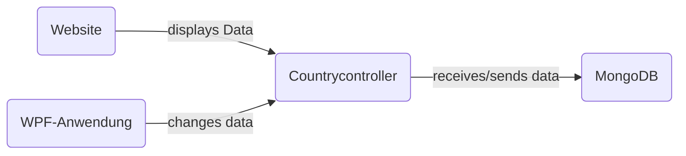
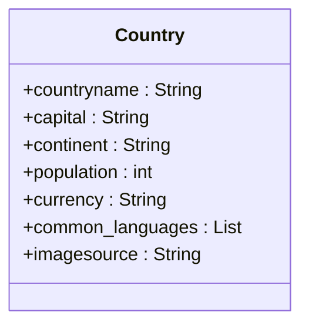

# CountryGuide-API
Dieses Projekt beinhaltet einen Server, welcher eine REST-API bereitstellt, sowie 2 Clients, welche auf diese API zugreifen und die CRUD-Operationen abbilden. Bei diesen 2 Clients handelt es sich um eine WPF-Anwendung und eine Website gemacht mit HTML, CSS und Javascript. 

Meine Idee war eine API, mit welcher man über den Website-Client ganz einfach verschiedene wichtige Informationen über Länder bekommt. Es soll ebenfalls möglich sein diese Daten in der WPF-Anwendung zu verändern (Admin-Client). Außerdem soll es einfach möglich sein, die Informationen welche gespeichert werden in Zukunft leicht erweitern zu können.

## Inhaltsverzeichnis
- [Softwaredesign](#softwaredesign)
- [Beschreibung von wichtigen Softwareabschnitten](#beschreibung-von-wichtigen-softwareabschnitten)
- [API-Endpoint-Beschreibung](#api-endpoint-beschreibung)
- [Klassendiagramm](#klassendiagramm)
- [Diskussion](#diskussion)

<br>

## Softwaredesign


#### CountryGuide-API
Der Server + API bildet das Herzstück des Projektes. Der Server und die API-Endpoints sind in Java und mit dem Spring Boot Framework programmiert. Die API verwaltet alle Anfragen der Clients und speichert/sendet Daten von der MongoDB-Datenbank.

#### Website mit HTML, CSS, Javascript
Die Website dient als einfache Benutzeroberfläche, auf welcher die Nutzer ganz einfach mit einem Textfeld von jedem in der Datenbank gespeicherten Land verschiedene nützliche Informationen bekommen können. Außerdem kann man sich alle Länder welche gespeichert sind anzeigen lassen und direkt per Klick auf den Namen ein Land aufrufen. 

#### WPF Anwendung
Die WPF Anwendung dient als "Adminprogramm" der CountryGuide-API. Über die WPF Anwendung können alle Daten einfach hinzugefügt, geändert, oder auch gelöscht werden.

## Beschreibung von wichtigen Softwareabschnitten
#### API/Server
Für den Server und die API wurden folgende Dependencies verwendet:

```xml 
<dependencies>
        <dependency>
            <groupId>org.springframework.boot</groupId>
            <artifactId>spring-boot-starter-actuator</artifactId>
        </dependency>
        <dependency>
            <groupId>org.apache.httpcomponents</groupId>
            <artifactId>httpclient</artifactId>
            <scope>test</scope>
        </dependency>
        <!-- https://mvnrepository.com/artifact/com.googlecode.json-simple/json-simple -->
        <dependency>
            <groupId>com.googlecode.json-simple</groupId>
            <artifactId>json-simple</artifactId>
            <version>1.1.1</version>
        </dependency>
        <dependency>
            <groupId>org.springframework.boot</groupId>
            <artifactId>spring-boot-starter-actuator</artifactId>
        </dependency>
        <dependency>
            <groupId>org.springframework.boot</groupId>
            <artifactId>spring-boot-starter-data-mongodb</artifactId>
        </dependency>
        <dependency>
            <groupId>com.h2database</groupId>
            <artifactId>h2</artifactId>
            <scope>runtime</scope>
        </dependency>
        <dependency>
            <groupId>org.springframework.boot</groupId>
            <artifactId>spring-boot-starter-test</artifactId>
            <scope>test</scope>
        </dependency>

        <dependency>
            <groupId>org.springframework.cloud</groupId>
            <artifactId>spring-cloud-dependencies</artifactId>
            <version>${spring-cloud.version}</version>
            <type>pom</type>
            <scope>import</scope>
        </dependency>
        <dependency>
            <groupId>org.springframework.cloud</groupId>
            <artifactId>spring-cloud-starter-circuitbreaker-resilience4j</artifactId>
        </dependency>
        <dependency>
            <groupId>org.springframework.cloud</groupId>
            <artifactId>spring-cloud-starter-gateway</artifactId>
        </dependency>

        <dependency>
            <groupId>org.springframework.boot</groupId>
            <artifactId>spring-boot-starter-test</artifactId>
            <scope>test</scope>
        </dependency>
        <dependency>
            <groupId>org.springframework.cloud</groupId>
            <artifactId>spring-cloud-starter-contract-stub-runner</artifactId>
            <scope>test</scope>
        </dependency>
</dependencies>
```

Außerdem muss man die API-Endpoints bereitstellen. Der folgende Codeabschnitt zeigt die Implementierung des Endpoints <code><b>/addCountry</b></code>: 

```java
@RequestMapping(method=RequestMethod.POST, value="/addCountry")
        public String addCountry(@RequestBody Country country) {
            countryService.addCountry(country);
            String response = "{\"success\": true, \"message\": Country was added successfully.}";
            return response;
        }
```

Der Punkt [API Beschreibung](#api-beschreibung) beschreibt die genaue Funktion von diesem und anderen Endpoints genauer. 

### Website
Die Website basiert auf basic HTML, CSS und Javascript. Die wichtigen Teile des Codes sind dabei die GET-Zugriffe auf die API. 

##### GET-Request
Im folgenden Abschnitt ist die GET-Methode implementiert, welche beim Klicken des Search-Buttons ausgeführt wird: 
```javascript
function getCountry (countryInp) {
    let countryName = countryInp;
    let finalURL = `http://localhost:3001/getcountry/${countryName}`;
    console.log(finalURL);

    fetch(finalURL).then((response) => response.json()).then((data) => {
        var cpopulation = (data.population).toLocaleString(
            undefined, { minimumFractionDigits: 0 }
          );

        result.innerHTML = `
            
            <h2>${data.countryname}</h2>
            <div class="wrapper">
                <div class="data-wrapper">
                    <h4>Capital:</h4>
                    <span>${data.capital}</span>
                </div>
            </div>
            <div class="wrapper">
                <div class="data-wrapper">
                    <h4>Continent:</h4>
                    <span>${data.continent}</span>
                </div>
            </div>
            <div class="wrapper">
                <div class="data-wrapper">
                    <h4>Population:</h4>
                    <span>${cpopulation}</span>
                </div>
            </div>
            <div class="wrapper">
                <div class="data-wrapper">
                    <h4>Currency:</h4>
                    <span>${data.currency}</span>
                </div>
            </div>
            <div class="wrapper">
                <div class="data-wrapper">
                    <h4>Common Languages:</h4>
                    <span>${Object.values(data.common_languages).toString().split(",").join(", ")}</span>
                </div>
            </div>
        `;
    })
}
```

Wie man sehen kann, wird sich zuerst vom Textfeld der Name des gewünschten Landes geholt, anschließend werden die Informationen mit der <code>fetch()</code> Methode vom Server geholt und es werden HTML-Elemente erstellt, welche die Daten anzeigen.

#### WPF Anwendung
Da die WPF Anwendung, gleich wie die Blazor WebApp, in C# implementiert wurde ist der Code, welcher für die Interaktion mit der RaceresultAPI zuständig ist, sehr ähnlich zu dem der Blazor WebApp. Lediglich die Codeteile, welche die Darstellung der Daten vornehmen unterscheidet sich. 

##### POST
Im nachfolgendem Codeabschnitt ist die Implementierung des POST-Requests, um Objektdaten an den Server zu schicken und ein neues Objekt zu speichern, dargestellt.
```c#
try
{
	string[] common_languages = CommonLanguagesTextBox.Text.Split(',');

	Country country = new Country
	{
		Countryname = CountryTextBox.Text,
		Capital = CapitalTextBox.Text,
		Continent = ContinentTextBox.Text,
		Population = Int32.Parse(PopulationTextBox.Text),
		Currency = CurrencyTextBox.Text,
		Common_languages = common_languages,
		Imagesource = ImagesourceTextBox.Text
	};

	string jsonString = JsonConvert.SerializeObject(country);

	using (HttpClient client = new HttpClient())
	{
		HttpResponseMessage response = await client.PostAsJsonAsync(ApiUrl + "/addCountry", country);
		response.EnsureSuccessStatusCode();

		MessageBox.Show("Data sent successfully!", "Success", MessageBoxButton.OK, MessageBoxImage.Information);
	}
}
catch (Exception ex)
{
	MessageBox.Show("Error: " + ex.Message, "Error", MessageBoxButton.OK, MessageBoxImage.Error);
}
```
Hier wird der Endpoint <code>/addCountry</code> verwendet, um ein neues Country-Objekt in die Datenbank einzufügen.

##### PUT
Im nachfolgendem Codeabschnitt ist die Implementierung eines PUT-Requests, um Objektdaten an den Server zu schicken und ein Element zu ersetzen, dargestellt.
```c#
try
{
	using (HttpClient client = new HttpClient())
	{
		string[] common_languages = CommonLanguagesTextBox.Text.Split(',');

		Country country = new Country
		{
			Countryname = CountryTextBox.Text,
			Capital = CapitalTextBox.Text,
			Continent = ContinentTextBox.Text,
			Population = Int32.Parse(PopulationTextBox.Text),
			Currency = CurrencyTextBox.Text,
			Common_languages = common_languages,
			Imagesource = ImagesourceTextBox.Text
		};

		string jsonString = JsonConvert.SerializeObject(country);

		string updateEndpoint = "/updateCountry/" + CountryTextBox.Text;

		HttpResponseMessage response = await client.PutAsJsonAsync(ApiUrl + updateEndpoint, country);
		response.EnsureSuccessStatusCode();

		MessageBox.Show("Data sent successfully!", "Success", MessageBoxButton.OK, MessageBoxImage.Information);
	}
}
catch (Exception ex)
{
	MessageBox.Show("Error: " + ex.Message, "Error", MessageBoxButton.OK, MessageBoxImage.Error);
}
```
Hier wird der Endpoint <code>/updateCountry/{countryname}</code> verwendet, um die Daten eines Landes zu ändern.

##### DELETE
Im nachfolgendem Codeabschnitt ist die Implementierung eines DELETE-Requests, um bestimmte Daten vom Server zu löschen, dargestellt.
```c#
try
{
	string countryName = CountrynameTextBox.Text;

	using (HttpClient client = new HttpClient())
	{
		HttpResponseMessage response = await client.DeleteAsync(ApiUrl + "/deleteCountry/" + countryName);
		response.EnsureSuccessStatusCode();

		MessageBox.Show("Country name sent successfully!", "Success", MessageBoxButton.OK, MessageBoxImage.Information);
	}
}
catch (Exception ex)
{
	MessageBox.Show("Error: " + ex.Message, "Error", MessageBoxButton.OK, MessageBoxImage.Error);
}

```
Hier wird der Endpoint <code>/deleteCountry/{countryname}</code> verwendet, um ein Land aus der Datenbank zu löschen.

## API-Endpoint-Beschreibung

### Country
<details>
 <summary><code>POST</code> <code><b>/addCountry/{countryname}</b></code> <code>(Fügt ein Land hinzu)</code></summary>

##### Parameters

> | data type      | type         | format                  | description                                                   |
> |----------------|--------------|-------------------------|---------------------------------------------------------------|
> | Serie          | Requestbody  | object (JSON or YAML)   | N/A  |


##### Responses

> |content-type             | response example / description                                                                |
> |-------------------------|-----------------------------------------------------------------------------------------------|
> |`json string`       | `{"success":"true","message":"Success Message"}`                                              |


</details>
<details>
 <summary><code>GET</code> <code><b>/getcountries</b></code> <code>(Gibt alle Länder zurück)</code></summary>

##### Parameters

> | data type      | type         | format                  | description                                                   |
> |----------------|--------------|-------------------------|---------------------------------------------------------------|
> | None          | -  | -   | N/A  |


##### Responses

> |content-type             | response example / description                                                                |
> |-------------------------|-----------------------------------------------------------------------------------------------|
> |`json string`       | `JSON Länderliste`                                              |


</details>
<details>
 <summary><code>GET</code> <code><b>/getcountry/{countryname}</b></code> <code>(Gibt ein Land zurück)</code></summary>

##### Parameters

> | data type      | type         | format                  | description                                                   |
> |----------------|--------------|-------------------------|---------------------------------------------------------------|
> | String          | Path  | String   | {Name} des angeforderten Landes  |


##### Responses

> |content-type             | response example / description                                                                |
> |-------------------------|-----------------------------------------------------------------------------------------------|
> |`json string`       | `JSON Country-Objekt`                                              |


</details>
<details>
 <summary><code>GET</code> <code><b>/addCountry</b></code> <code>(Fügt ein Country-Objekt zur Datenbank hinzu)</code></summary>

##### Parameters

> | data type      | type         | format                  | description                                                   |
> |----------------|--------------|-------------------------|---------------------------------------------------------------|
> | None          | -  | -   | N/A  |


##### Responses

> |content-type             | response example / description                                                                |
> |-------------------------|-----------------------------------------------------------------------------------------------|
> |`json string`       | `JSON String-Liste an Seriennamen`                                              |


</details>
<details>
 <summary><code>DELETE</code> <code><b>/deleteCountry/{countryname}</b></code> <code>(Löscht ein Land)</code></summary>

##### Parameters

> | data type      | type         | format                  | description                                                   |
> |----------------|--------------|-------------------------|---------------------------------------------------------------|
> | String          | Path  | String   | {countryname} des zu löschenden Landes  |


##### Responses

> |content-type             | response example / description                                                                |
> |-------------------------|-----------------------------------------------------------------------------------------------|
> |`json string`       | `{"success":"true","message":"Success Message"}`                                              |


</details>
<details>
 <summary><code>PUT</code> <code><b>/updateCountry/{countryname}</b></code> <code>(Updatet ein Land)</code></summary>

##### Parameters

> | data type      | type         | format                  | description                                                   |
> |----------------|--------------|-------------------------|---------------------------------------------------------------|
> | String          | Path  | String   | {countryname} des gewünschten Landes  |
> | Rennen | Requestbody | object (JSON or YAML) | N/A |   

</details>

### Verwaltung 
<details>
 <summary><code>GET</code> <code><b>/actuator/health</b></code> <code>(Gibt den Status der API zurück)</code></summary>

##### Parameters

> | data type      | type         | format                  | description                                                   |
> |----------------|--------------|-------------------------|---------------------------------------------------------------|
> | None          | -  | -   | N/A  |


##### Responses

> |content-type             | response example / description                                                                |
> |-------------------------|-----------------------------------------------------------------------------------------------|
> |`json string`       | `{"success":"true","message":"UP", "success":"false","message":"DOWN"}`  |

  
</details>

### Datentypen
<details>
<summary><code><b>Country</b></code><code>(Abbildung einer Country)</code></summary>


##### Membervariablen
> | Datentyp | Name | Beschreibung | Required |
> |----------------|--------------|-----------------------|--------------|
> | String          | countryname  | Databasekey   | yes  |
> | String          | capital  | N/A   | yes  |
> | String          | continent  | N/A   | yes  |
> | Integer          | population  | N/A   | yes  |
> | String          | currency  | N/A   | yes  |
> | List (String)          | common_languages  | N/A   | yes  |
> | String          | imagesource  | N/A   | yes  |

</details>

## Klassendiagramm
Das folgende UML-Klassendiagramm zeigt die Eigenschaften der Klasse Country.


## Diskussion
Der Endstand des Projektes kann sind 3 Programme. Ein Server welcher die Daten speichert und verwaltet, ein Client für "normale" Benutzer, um Daten aus dem Server abzurufen und anzuzeigen und ein Adminclient, mit dem die Datenbank verändert werden kann. Die CountryGuide-API ist eine einfache REST-API, welche Daten über Länder verwaltet und speichert. Die Speicherung erfolgt dabei mit einer MongoDB Datenbank.

Die Erarbeitung meines Projektes verlief im Wesentlichen sehr gut. Die Implementierung der REST-API in Spring war dabei der einfachste Teil, da wir damit vor dem Projekt schon am meisten Erfahrung hatte. Die Arbeit um die WPF Anwendung war hingegen etwas schwerer, da ich mit WPF bis zu diesem Projekt nur wenig Erfahrung beziehungsweise Berührungspunkte hatte. Durch Recherche im Internet waren allerdings alle Probleme relativ leicht zu lösen. Auch HTML, CSS und Javascript waren mir natürlich bekannt, allerdings war es anfangs schwer ohne assistierendem Framework daraus etwas ansprechendes zu machen. Auch hier fand ich allerdings eine Lösung für alle meine Probleme im Internet.

### Mögliche Erweiterungen
#### Erweiterung der Informationen pro Land
Eine mögliche Erweiterung wäre die Implementierung von mehr verschiedenen nützlichen Informationen über die Länder, wie zum Beispiel lokale Gerichte oder ähnliches. Dies sollte einfach möglich sein, da man eigentlich nur am Country-Objekt weitere Attribute hinzufügen müsste.

#### Darstellung
Die Darstellung auf der WebApp könnte noch feingeschliffen werden. Eventuell noch einen Header oder Footer hinzufügen auf dem Informationen angezeigt werden. Auch die WPF-App kann von der Darstellung her noch verbessert werden.
